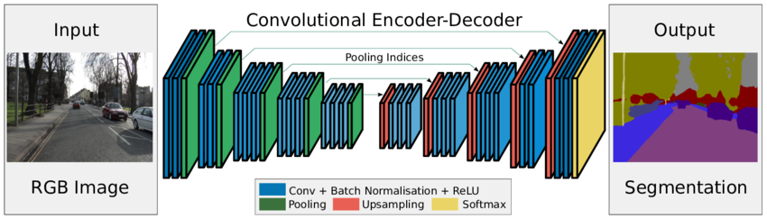

# Semantic_Segmentation_for_Self-Driving_Cars
     Semantic segmentation of images for self driving cars using segnet model with cityscapes dataset. We developed a model using segnet architecture and trained it with cityscapes dataset using kmeans to assign classes for each pixel for pixel wise training for semantic segmentation
# Semantic Segmentation 
Semantic segmentation is the task of assigning a class to every pixel in a given image.
# Model Architecture
## Segnet

# Dataset
 https://www.kaggle.com/dansbecker/cityscapes-image-pairs
